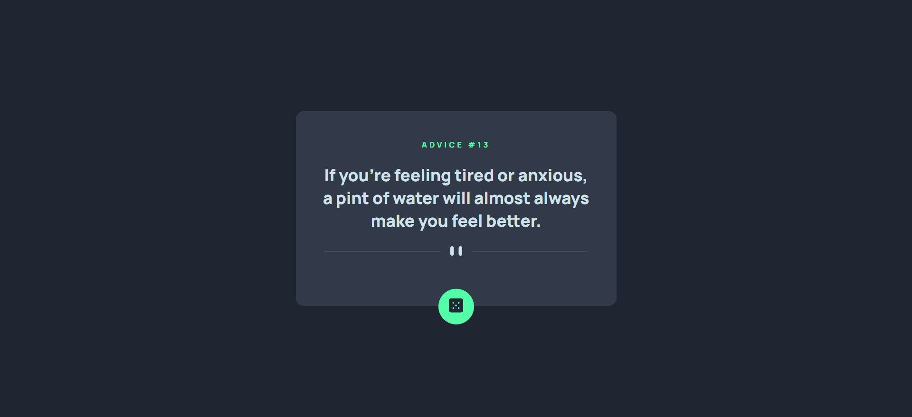

# App Gerador de Conselhos

- [View Website](https://pedrowfilho.github.io/advice-generator-app/) 🖱️

## Visão Geral

### Desafio

Este é um exercício do Curso Dev Quest - Dev em Dobro - Desenvolvimento Web Full Stack, cujo objetivo é criar um app gerador de conselhos consumindo dados de uma API.

### Habilidades/Técnicas

- Fetch API
- JavaScript
- HTML
- CSS
- Flexbox
- Git

## Autor

Pedro Wagner - Front End Developer

